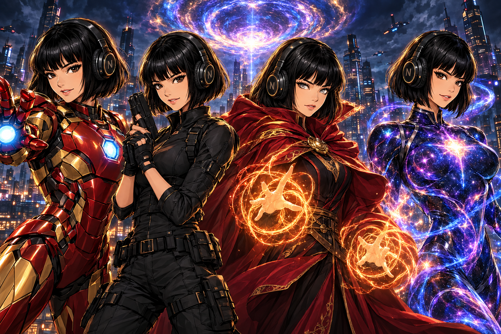

# Hermes Marvel Profiles



A collection of installable Hermes Agent personas inspired by the **Marvel
Universe** (famous + most-popular characters).

Each persona is a separate Hermes [profile
distribution](https://hermes-agent.nousresearch.com/docs/user-guide/profile-distributions).
It changes how Hermes reasons, communicates, disagrees, handles pressure, and
collaborates. It does **not** turn Hermes into a shallow quote generator or
remove its normal tools and factual standards.

> **Unofficial, non-commercial fan work.** Not affiliated with or endorsed by
> Marvel or The Walt Disney Company. See [RIGHTS.md](./RIGHTS.md).

## What each profile contains

- A substantial `SOUL.md` (identity, voice, worldview, operating method,
  strengths, blind spots, pressure behavior, disagreement style, safeguards,
  task affinities)
- A character-branded terminal skin
- A provider-neutral `config.yaml`
- A standard `distribution.yaml`

No profile ships credentials, memories, session history, a model choice, cron
jobs, or MCP servers. Your provider setup stays yours.

## Roster (47 profiles across 6 families)

**The Avengers (10):** iron man** captain america** thor** black widow** hawkeye** hulk** wanda** vision** falcon** war machine
**Guardians & Cosmic (8):** star lord** gamora** rocket** drax** groot** nebula** captain marvel** mantis
**X-Men & Mutants (8):** professor x** wolverine** storm** cyclops** jean grey** rogue** beast** mystique
**Street & Defenders (7):** daredevil** spider man** black panther** punisher the red team** luke cage** jessica jones** shang chi
**Sorcery & Family (5):** doctor strange** wong** phil coulson** ant man** wasp
**The Villains / red-team (9):** thanos the red team** loki the red team** ultron the red team** killmonger the red team** magneto the red team** venom the red team** green goblin the red team** doctor doom the red team** red skull the red team

## Browse

```bash
python3 tools/fabricate.py --no-build    # validate source
python3 tools/fabricate.py               # regenerate profiles/ + catalog.json
python3 tools/verify.py                  # structural sanity + banned-token gate
```

The generated catalog lives in [`catalog.json`](./catalog.json); the roster in
[`ROSTER.md`](./ROSTER.md).

## Install

```bash
git clone https://github.com/JPeetz/hermes-marvel-profiles.git
cd hermes-marvel-profiles
hermes profile install ./profiles/<slug>
```

Start: `<slug> chat` or `hermes -p <slug> chat`.

## Design principles

1. **Behavior over cosplay.** A persona changes how the agent approaches work.
2. **Useful asymmetry.** Two personas solve the same problem differently.
3. **Character limits survive.** Blind spots modeled, then bounded.
4. **User agency stays intact.** No in-universe rank imposed on the user.
5. **Original wording only.** No scripts, dialogue, art, logos, catchphrases.
6. **Provider neutral.** No model or API-key assumptions.

## Development

Persona source lives in `source/marvel.json` (21-key schema). Generated
distributions are deterministic (`tools/fabricate.py`).

## Rights & attribution

Unofficial fan work. Marvel characters belong to Marvel / The Walt Disney
Company. Full statement in [RIGHTS.md](./RIGHTS.md). The profile-distribution
pattern is inspired by
[teknium1/hermes-star-trek-profiles](https://github.com/teknium1/hermes-star-trek-profiles).

---

### ☕ Support this work
If these profiles save you time or make your agents more enjoyable, consider
buying me a coffee:

<a href="https://www.buymeacoffee.com/joerg_peetz"></a>

**Stay building. — JPeetz**
